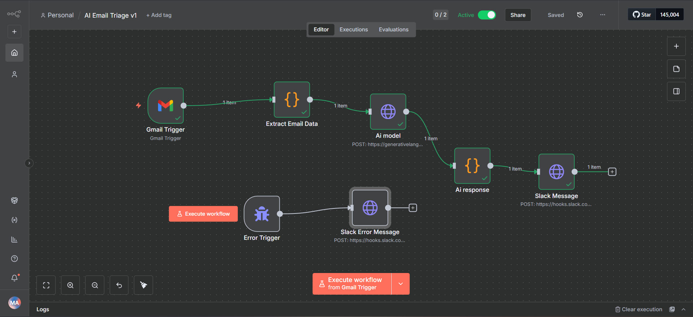
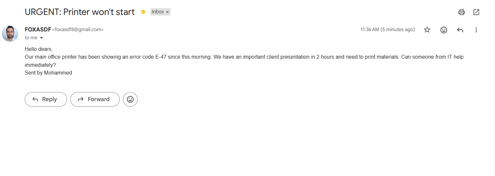
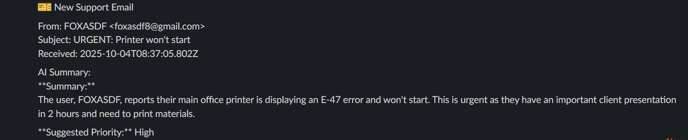

# AI-Powered Support Email Summarizer

An automated workflow that monitors support emails, generates AI summaries using Google's Gemini API, and posts them to Slack for immediate team visibility.

## Problem Statement

Support teams often get overwhelmed with incoming emails. Reading through each one to assess priority and context takes valuable time. This automation provides instant, intelligent summaries to help teams respond faster.

## Solution

This n8n workflow:
- Monitors Gmail for new support emails
- Extracts and structures email data
- Sends email content to Gemini AI for summarization
- Posts formatted summaries to Slack with priority indicators
- Includes error handling for production reliability

## Technologies Used

- **n8n** - Workflow automation platform
- **Google Gemini API** - AI-powered text summarization
- **Gmail API** - Email monitoring
- **Slack Webhooks** - Team notifications
- **JavaScript** - Data transformation and processing

## Workflow Architecture

### Main Flow
1. Gmail Trigger - Monitors inbox for new emails
2. Extract Email Data (Code) - Cleans and structures incoming data
3. Gemini API (HTTP Request) - Generates intelligent summary
4. Parse Response (Code) - Formats AI output
5. Slack Notification (HTTP Request) - Posts to team channel

### Error Handling
- Error Trigger monitors for failures
- Automatic Slack alerts when workflow encounters issues
- Ensures team is notified of any processing problems

## Features

- Real-time email monitoring
- AI-powered summarization highlighting:
  - Main issue/request
  - Urgency indicators
  - Suggested priority level
- Clean Slack formatting with emoji indicators
- Comprehensive error handling
- Zero manual intervention required

## Sample Output
### Email

### Ai Output Response 

## Setup Instructions

### Prerequisites
- n8n instance (cloud or self-hosted)
- Gmail account with API access
- Google Gemini API key
- Slack workspace with webhook access

### Installation

1. Import the workflow JSON file into your n8n instance
2. Configure Gmail trigger with your credentials
3. Add your Gemini API key to the HTTP Request node
4. Set up Slack incoming webhook and add URL to both notification nodes
5. Activate the workflow

### Configuration

**Gmail Trigger:**
- Connect your Gmail account
- Set trigger to monitor specific labels/folders if needed

**Gemini API:**
- Get API key from Google AI Studio
- Temperature: 0.4 (balanced creativity/accuracy)
- Max tokens: 200

**Slack Webhook:**
- Create incoming webhook in Slack app settings
- Choose notification channel
- Update URL in both HTTP Request nodes

## What I Learned

- n8n workflow design and node configuration
- API integration (REST APIs, authentication)
- JavaScript for data transformation in automation contexts
- Error handling and monitoring in production workflows
- Working with AI APIs for practical business use cases

## Future Improvements

- Add email classification (bug report, feature request, question)
- Implement priority-based routing to different Slack channels
- Store summaries in a database for analytics
- Add sentiment analysis to detect frustrated customers
- Create automated ticket creation in support systems

## License

MIT License - Feel free to use and modify

## Contact

Mohammed Algald - Foxasdf8@gmail.com - LinkedIn Profile: https://www.linkedin.com/in/mohammed-aljald-a801bb228
